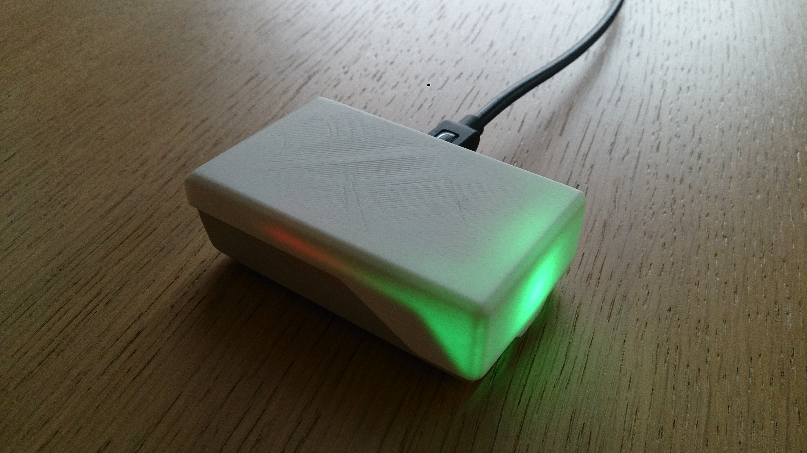
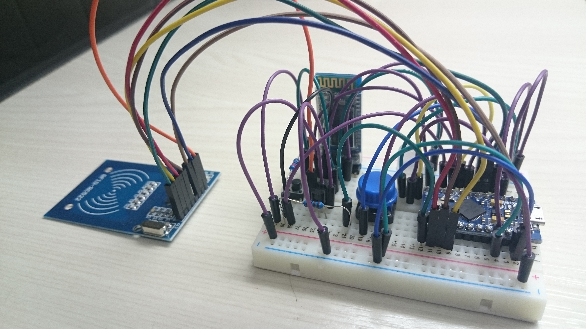
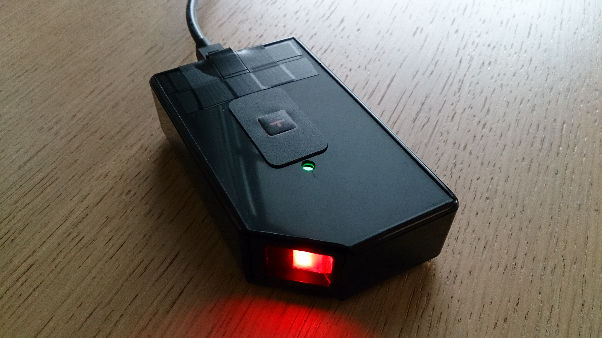
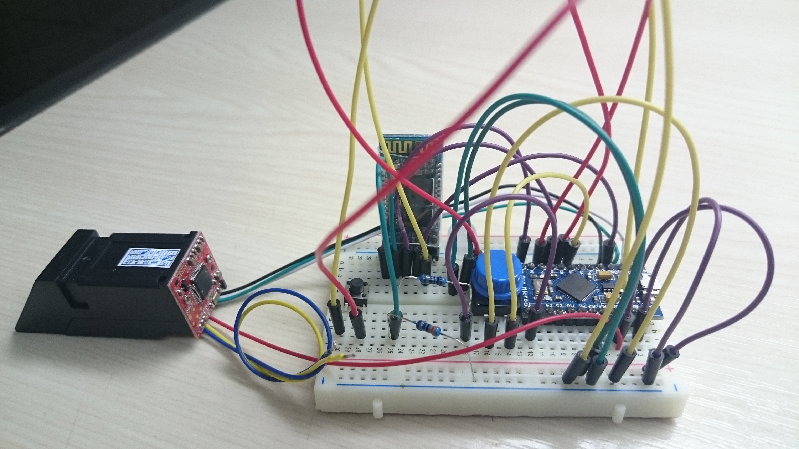

#Case 
This folder contains files for the case which you may 3d print.
The case was degigned using TurboCAD (<filename>.tcd) and then exported into DXF (<filename>.dxf) for importing into other CAD Applications and into STL (<filename>.stl) files for importing them into a Slicer-Software (to prepare for your 3D Printer). 

##Files

###klonk_rfid_rc522 case
Printed 3d case

Breadboard view

###klonk_fingerprint case
Customised standard box case

Breadboard view

