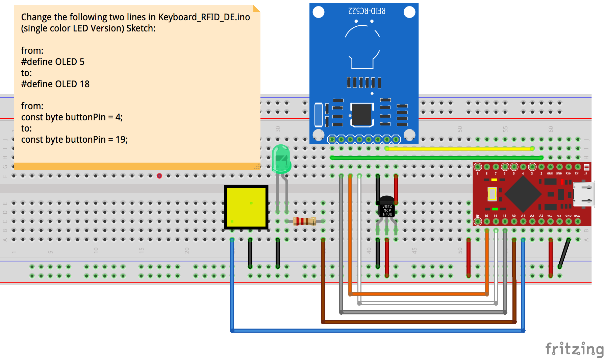
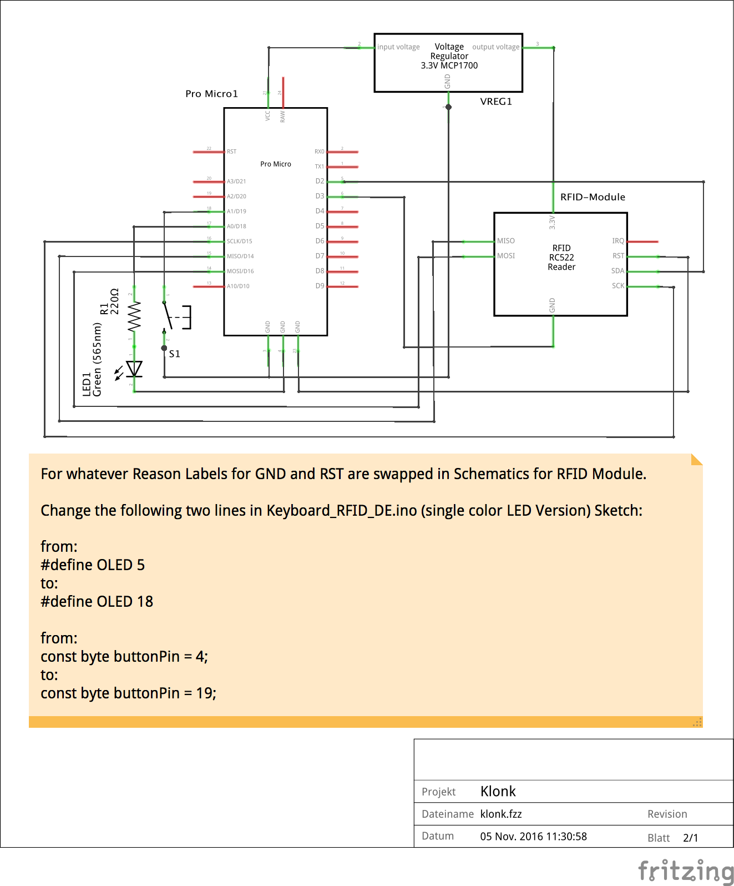
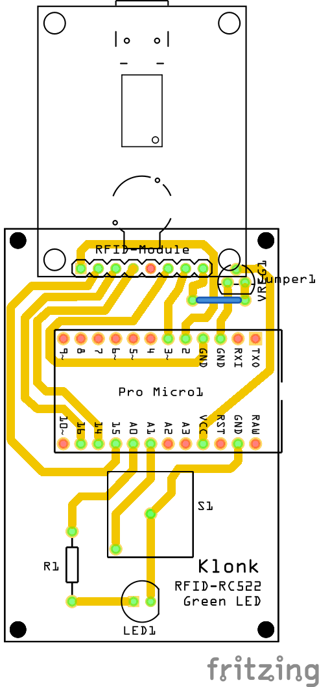

#Electronics 
This folder contains schematics and board files. To create these file we used Fritzing (http://www.fritzing.org/).
One need to add these Parts to the Library:
* MFRC522 (RFID-Board): https://github.com/miguelbalboa/rfid/tree/master/doc/fritzing
* ProMicro: https://github.com/unorthodox-engineers/unorthodox-arduino/tree/master/Unorthodox/fritzing/parts

##Files

###klonk_rfid_rc522_green_led.fzz
Fritzing Project File. Fritzing is an open-source hardware initiative that makes electronics accessible as a creative material for anyone. You may download the software form: http://fritzing.org/

###klonk_rfid_rc522_green_led_breadboard.(png|pdf)
Exported breadboard view

###klonk_rfid_rc522_green_led_schematics.(png|pdf)
Exported Schematics view

###klonk_rfid_rc522_green_led_pcb.(png|pdf)
Exported PCB view

##Bill of Materials
* Pro Micro1: Sparkfun Pro Micro input voltage 5.0 V; Prozessor MK20DX256; Variante variant 2; i/o voltage 5.0 V (or compatible)
* RFID-Module: RFID-RC522-v2
* VREG1: Voltage Regulator 3.3V MCP1700
* LED1: Green (565nm) LED Paket 5 mm THT
* R1: 220Ω Resistor THT Tolerance ±5%
* Button switch: 2 pin
